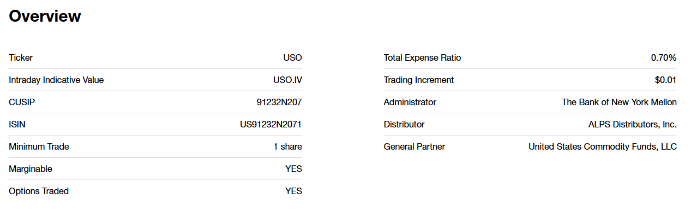
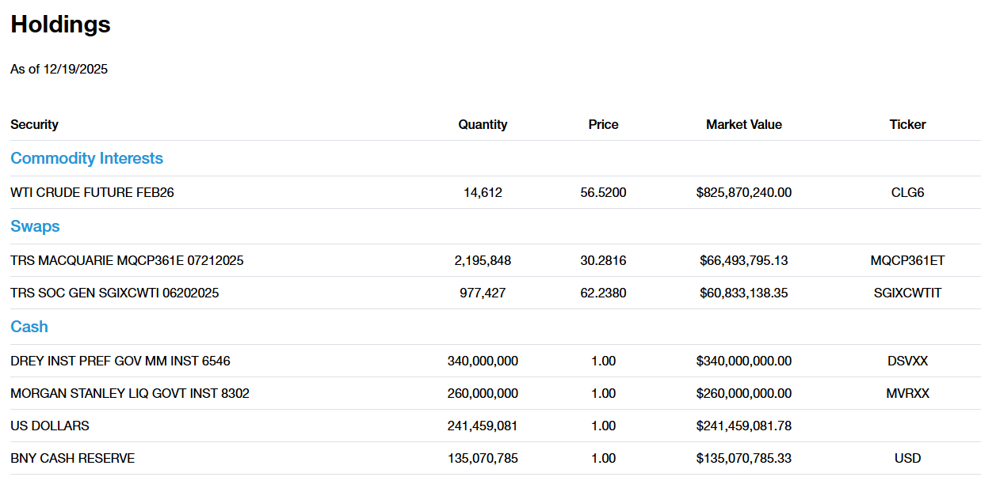
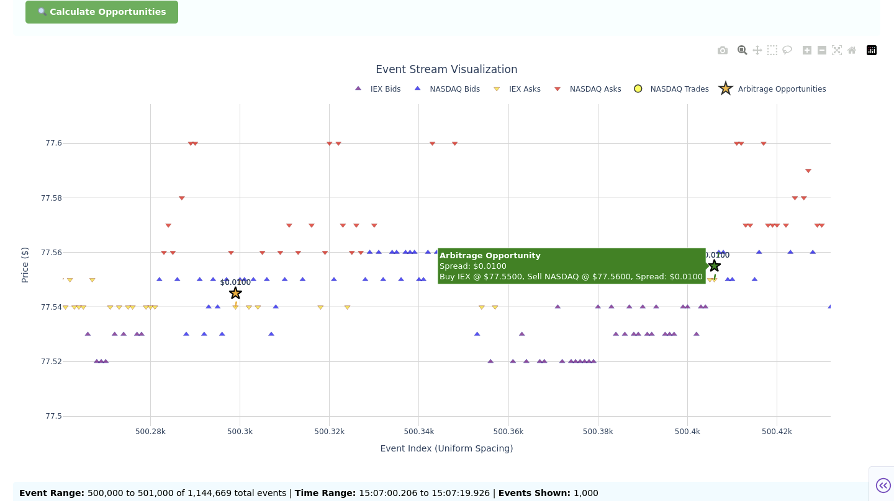
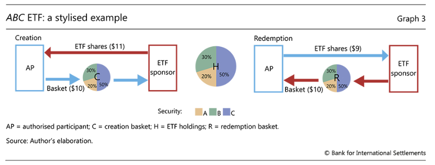

# Venue Arbitrage and ETF Arbitrage Implementation for United States Oil Fund, LP (USO)

## Table of Contents

- [Overview](#overview)
- [Biographies](#biographies)
- [Phase 1: Understanding PCAPs and Data Sources](#phase-1-understanding-pcaps-and-data-sources)
  - [NASDAQ Data Processing Pipeline](#nasdaq-data-processing-pipeline)
- [Phase 2: Strategy Studio Integration and Automation](#phase-2-strategy-studio-integration-and-automation)
  - [Data Visualization and Analysis Tools](#data-visualization-and-analysis-tools)
- [Phase 3: The Strategies](#phase-3-the-strategies)
  - [What Is USO?](#what-is-uso)
  - [The Venue Arbitrage Strategy](#the-venue-arbitrage-strategy)
  - [Venue Arbitrage Strategy Variations](#venue-arbitrage-strategy-variations)
  - [ETF Arbitrage: Core Mechanism and Trading Intuition](#etf-arbitrage-core-mechanism-and-trading-intuition)
  - [ETF Arbitrage Strategy: `EtfArb1Strategy`](#etf-arbitrage-strategy-etfarb1strategy)
- [Key Technical Challenges & Solutions](#key-technical-challenges--solutions)
- [Results and Performance](#results-and-performance)
- [Conclusion and Summary](#conclusion-and-summary)

---

## Overview

This report outlines the process of building a robust arbitrage-trading strategy including data parsing and pipelining. The goal was to transform raw PCAP (Packet Capture) files from Databento and IEX into actionable data and trading behavior for ETF and Venue Arbitrage Trading Strategies on Strategy Studio, a platform used to develop and test trading strategies. The project involved multiple technical phases, including parsing raw data, interweaving market data between exchanges, and implementing various versions of these strategies.

Each phase presented unique challenges and learning opportunities, which are detailed below. This write-up is designed to be accessible to readers without prior HFT or Algorithmic Trading experience, offering clarity through structured explanations and real-world analogies.

## Biographies

{ width=200px }

**Danny Silverstein (dannys2)**: I am a senior studying Applied Mathematics with a minor in Computer Science. I am graduating in May 2026 and am passionate about applying mathematics to the trading industry, especially having to do with derivatives pricing and the management of ETFs with derivative underlyings. I love tackling extremely challenging topics, whether it be mathematical proofs or finding inefficiencies in the market that I can capitalize on. I created the initial Venue Arbitrage and ETF Arbitrage strategies in Strategy Studio, which I then further refined through testing to capitalize on price discrepancies. Along with this, I implemented variations of the venue arbitrage strategy with different execution mechanisms (long/short opposite exchanges vs long only), with the majority of the emphasis being on position sizing and order routing. I developed the Nasdaq + IEX data merging, modifications to the IEX parser including scripts for automation, and general project architecture to ensure complete strategy robustness.

LinkedIn: https://www.linkedin.com/in/dannysilverstein/ Email: dhsilver06@gmail.com

**Anton Charov (acharov2)**: I am a senior studying Computer Science, and plan to graduate in May 2026. I am always hungry for market micro-structure and building robust trading strategies with systems to accompany them. I am particulary fond of equity options, and derivative products which provide value. I always say if it doesn't make PnL, it shouldn't be in production -- of course, there are edge cases, which a good trader considers. For this project, I created multiple venue arb trading stratgies, implemented stragical variations of arbs for better fill rates, built powerful strategy studio automation commands, created a full NASDAQ parser compatible with strategy studio, developed interactive tick-level multi-exchange visualizations with arb highlights, and other optimizations and modifcations to complementary scripts.

LinkedIn: http://www.linkedin.com/in/anton-charov Email: acharov11@gmail.com

**Aditya Dalal (adala9)**: I am a senior studying Math and Computer Science, and plan to graduate in May 2026. I am passionate about applications of math and CS to the real world and am especially interested in the financial industry. I worked on making the ETF Arbitrage strategy and loading in the CME data and writing scripts to automate the PCAP extraction process.

LinkedIn: http://www.linkedin.com/in/aditya-dalal-bba2602b3 Email: dalaladi224@gmail.com

**Sohan Hajra (shajra2)**: I am a senior studing Mathematics and Computer Science with a minor in Statistics, and plan to graduate in May 2026. I am passionate about market microstructure, creating data driven trading systems and formulating trading strategies. I primarily worked on creating the ETF Arbitrage Strategy and making it behave more intelligently to mimic how real market makers operate.

Linkedin: https://www.linkedin.com/in/sohan-hajra/ Email: sohancollege27@gmail.com

---

## Phase 1: Understanding PCAPs and Data Sources

### Defining the Objective

High-frequency trading relies on precise and timely market data. The primary goal of this project was to take raw market data captured in PCAP files, process it efficiently, and use it to build trading strategies. This required:

- Parsing PCAP files to extract meaningful data.
- Preparing the data for Strategy Studio to support trading decisions.

### What Are PCAPs?

Packet Capture (PCAP) files represent raw network data captured at the packet level. They are commonly used in networking and cybersecurity but are also crucial in finance for recording market data streams.

Each file contains a series of packets, each comprising a header and payload structured according to the network protocol in use. The PCAP header provides metadata describing each captured packet, such as its timestamp and size, while Ethernet headers define the link-layer frame structure. The remainder of the PCAP contains market data, which varies in structure from exchange to exchange.

In this project, the PCAP files contained:

- Ethernet headers.
- TCP/UDP packets.
- Market data messages from financial exchanges.

These files are large and complex, requiring specialized tools for decompression and parsing.

### Databento's Role

Databento provided the Nasdaq and CME market data in compressed PCAP formats. Their platform offered efficient tools for handling massive datasets:

- Compressed Files: PCAPs were stored in gzipped or zstd formats.
- Sequenced Batches: Data was organized sequentially to ensure integrity.

### Initial Challenges with PCAPs

- Understanding Packet Structure: The project began with a detailed study of the PCAP file structure, including Ethernet headers and payloads.
- Corrupted Packets: Some packets were incomplete or corrupt, necessitating careful handling.
- Tool Familiarization: Tools like Wireshark were used to visualize and dissect packets. This helped identify patterns and validate parsing logic.

Once we familiarized ourselves with PCAPs, we explored them on a per-exchange basis. Starting with Nasdaq.

Exchanges we used:

- CME - For CL contracts
- Nasdaq - For USO ETF
- IEX - For USO ETF

### Exploring CME PCAP Extraction
To construct the CME parsers we used the SBE tool from Real Logic Limited to take in the XML files from CME and extract header files for the parser. These files were then used to parse out the relevant templates (46,47) and display them in a .txt file.

A challenging task for CME was having to deal with the massive amount of storage needed for the PCAPs if they were extracted. This was especially difficult on a machine where RAM usage was limited as multiple students would access the vms at the same time to backtest and parse data. To get around this,the CME parser underwent 3 main iterations:
1) Reading extracted PCAP into memory and then parsing.
2) Reading extracted PCAP and parsing one packet at a time.
3) Reading the .zst file and piping the stream into the parser.

The last iteration was ultimately the one chosen as it performed the best when comparing speed, RAM usage, and multithreading capabilities. As a result of these iterations parsing one day’s worth of PCAPs into level 3 orderbook data took around ~15 minutes and negligible RAM space compared to the other two options which also suffered from being idle as the PCAP was extracted. To automate this process scripts were written to parse a day's worth in one go and combine all individual sections so they can be used by the backtesting software.

### Exploring Nasdaq PCAP Structure

The Nasdaq TotalView-ITCH (ITCH 5.0) protocol is a binary message format used by Nasdaq to disseminate real-time market data. ITCH messages are transmitted over UDP using the MoldUDP64 encapsulation protocol, which packages multiple ITCH messages into single UDP packets for efficient network transmission.

Each ITCH message begins with a single-byte message type identifier, followed by a fixed-length payload that varies by message type. The protocol supports dozens of message types, including order book updates (add, cancel, replace, execute), trades, system events, and administrative messages. Understanding these message structures is essential for parsing the raw binary data from PCAP files.

#### Example: Add Order No MPID Attribution Message (Type 'A')

The "Add Order No MPID Attribution" message is one of the most common message types in the ITCH feed. It represents a new order being added to the order book without Market Participator Identification (MPID) attribution. This message type is fundamental to reconstructing the Level 3 order book state.

**Message Structure:**

| Name | Offset | Length | Value | Notes |
|------|--------|--------|-------|-------|
| **Message Type** | 0 | 1 | "A" | Indicates "Add Order - No MPID Attribution Message" |
| **Stock Locate** | 1 | 2 | Integer | Locate code identifying the security |
| **Tracking Number** | 3 | 2 | Integer | Nasdaq internal tracking number |
| **Timestamp** | 5 | 6 | Integer | Nanoseconds since midnight |
| **Order Reference Number** | 11 | 8 | Integer | Unique reference number assigned to the new order at time of receipt |
| **Buy/Sell Indicator** | 19 | 1 | Alpha | "B" = Buy Order, "S" = Sell Order |
| **Shares** | 20 | 4 | Integer | Total number of shares associated with the order |
| **Stock** | 24 | 8 | Alpha | Stock symbol, right-padded with spaces |
| **Price** | 32 | 4 | Price (4) | Display price of the new order (scaled integer) |

#### Other Common ITCH Message Types

The ITCH protocol includes many other message types that are processed by the pipeline:

- **Type 'F'**: Add Order with MPID Attribution (similar to 'A' but includes market maker identification)
- **Type 'E'**: Order Executed Message (partial or full execution of an order)
- **Type 'C'**: Order Executed With Price Message (execution at price different from display price)
- **Type 'X'**: Order Cancel Message (partial cancellation)
- **Type 'D'**: Order Delete Message (full cancellation/removal)
- **Type 'U'**: Order Replace Message (modify existing order)
- **Type 'P'**: Non-Cross Trade Message (trade from hidden orders)
- **Type 'Q'**: Cross Trade Message (opening/closing crosses)

Each message type has its own fixed-length structure, allowing for efficient binary parsing.

## NASDAQ Data Processing Pipeline

Our pipeline converts NASDAQ TotalView-ITCH data from compressed PCAP files to Strategy Studio tick and trade files. It handles L3 order book messages, maintains state, and outputs L2 depth-by-price and trade data.

Derivations for message format obtained from:

- Databento's Nasdaq TotalView-ITCH: https://databento.com/docs/venues-and-datasets/xnas-itch#timestamps?historical=python&live=python&reference=python
- Official Nasdaq Totalview-ITCH 5.0 Specification: https://www.nasdaqtrader.com/content/technicalsupport/specifications/dataproducts/NQTVITCHSpecification.pdf
- MoldUDP64 Protocol Specification: https://www.nasdaqtrader.com/content/technicalsupport/specifications/dataproducts/moldudp64.pdf

The pipeline has 4 stages:

1. **Decompression**: `.zst` → `.pcap`
2. **PCAP Extraction**: `.pcap` → `.itch` (MoldUDP64 → ITCH messages)
3. **L3 to L2 Conversion**: `.itch` → Strategy Studio format (maintains order book)
4. **Data Management**: Batch processing, combining, and timestamp conversion

### Stage 1: Data Decompression

The pipeline first in `zst_to_pcap.py` takes a Databento `.pcap.zst` in zstandard-compressed PCAP format, and outputs a standard `.pcap` file. In order to do so, it uses `zstandard` for streaming decompression, processes it in 1MB chunks, and reports progress every 10MB or 5 seconds. Some considerations when running is that large files (multi-GB) may require sufficient disk space. The decompression ratio typically is 3-5x from compressed to uncompressed.

### Stage 2: PCAP to ITCH Conversion

In `pcap_to_itch_converter.py` input is taken as PCAP files containing MoldUDP64 packets, and output is given in the form of a Raw ITCH 5.0 binary stream. What is the process like? It uses `dpkt` and parses out the Ethernet/IP/UDP layers. Then it extracts the MOLDUDP64 payload: 10 bytes for Session ID (ASCII), 8 bytes for sequence number (big-endian), 2 bytes for message count (big-endian). For each it's message 2 bytes length + ITCH message body. As a final step, it frames the ITCH messages for the `itchfeed` parser: with the format `0x00` + `[1-byte length]` + `[ITCH bytes]`

Helpful details. The converter filters for UDP packets, handles IPv4 and IPv6, and skips messages that are >255 bytes (the ITCH 5.0 limit), and processes ~100k+ packets/second.

### Stage 3: L3 to L2 Conversion

Next, we convert Level 3 (order level) ITCH messages into Level 2 (price-level) depth data. We do this in `nasdaq_ss_tick_builder.py`, and manage our own order book state. This is done with a `PriceLevelBook` class which maintains: per-order tracking with `(order_id -> {side, price, size})`, and aggregated levels `(side -> price -> {size, num_orders})`.

#### Depth-by-Price (P) Tick Generation

The pipeline processes order book update messages to maintain a real-time view of price levels and emits depth-by-price ticks whenever a price level changes.

**Order Book Update Messages**:

| ITCH Message | Type | Action | L2 Output |
|-------------|------|--------|-----------|
| `A` / `F` | AddOrder | Add order to book, aggregate by price | Emit P tick if level changes |
| `E` | OrderExecuted | Reduce order size, update level | Emit P tick if level changes |
| `C` | OrderExecutedWithPrice | Same as E, but with execution price | Emit P tick if level changes |
| `X` | OrderCancel | Partial cancel, reduce size | Emit P tick if level changes |
| `D` | OrderDelete | Remove order completely | Emit P tick if level cleared |
| `U` | OrderReplace | Cancel old order, add new order | Emit 1-2 P ticks (old price, new price) |

**L3 to L2 Aggregation Logic**:

When an order is added at a price level, the system aggregates all orders at that price:
- If no level exists at that price: create new level, emit P tick
- If level exists: aggregate size (+shares), increment num_orders (+1), emit P tick

When an order is executed, canceled, or deleted:
- Reduce order size in tracking
- Update aggregated level: size decreases, num_orders may decrease
- If level becomes empty: emit P tick with size=0, num_orders=0

**Strategy Studio Format (P Ticks)**:

Columns:

- `COLLECTION_TIME`: UTC timestamp
- `SOURCE_TIME`: Same as COLLECTION_TIME
- `SEQ_NUM`: Synthetic sequence number
- `TICK_TYPE`: "P" (depth-by-price)
- `MARKET_CENTER`: "NASDAQ"
- `SIDE`: 1=bid, 2=ask
- `PRICE`: Price level (4 decimal precision)
- `SIZE`: Aggregated size at price level
- `NUM_ORDERS`: Number of orders at price level
- `IS_IMPLIED`: 0 (not implied)
- `REASON`: 1=UNATTRIBUTED, 2=ADD_ORDER, 3=PARTIAL_CANCEL, 4=FULL_CANCEL, 5=EXECUTED, 8=CANCEL_REPLACE
- `IS_PARTIAL`: 0 (not partial)

**When P Ticks Are Emitted**:

P ticks are emitted only when a price level's aggregated size or number of orders changes. This ensures Strategy Studio receives an accurate, real-time view of the order book depth without redundant updates.

#### Trade (T) Tick Generation

**Trade Message Types**:

| ITCH Message | Type | Description | Price Source |
|-------------|------|-------------|--------------|
| `P` | NonCrossTrade | Hidden order trades | In message |
| `Q` | CrossTrade | Opening/closing crosses | In message (cross_price) |
| `C` | OrderExecutedWithPrice | Visible order executed at different price | In message (execution_price) |
| `E` | OrderExecuted | Visible order executed | **Order book lookup** (requires tracking) |

**Order Book Tracking for E Messages**:

When processing `E` messages, the system maintains a simplified order book:

- Tracks `A`/`F` messages: `order_ref → {symbol, price, side}`
- Updates on `X`, `D`, `U` messages
- Uses order book to:
  1. Filter by symbol (only trades for tracked symbol)
  2. Look up execution price (E messages don't contain price)
  3. Determine trade side (1=BUY if order was bid, -1=SELL if order was ask)

**Strategy Studio Format (T Ticks)**:

Columns:

- `COLLECTION_TIME`: UTC timestamp
- `SOURCE_TIME`: Same as COLLECTION_TIME
- `SEQ_NUM`: Synthetic sequence number
- `TICK_TYPE`: "T" (trade)
- `MARKET_CENTER`: "NASDAQ"
- `PRICE`: Trade price (4 decimal precision)
- `SIZE`: Trade size (shares)
- `FEED_TYPE`: 1=consolidated (optional, empty if default)
- `SIDE`: 1=BUY, -1=SELL, ""=UNKNOWN (optional)
- `TRADE_COND_TYPE`: "" (optional)
- `TRADE_COND`: "OPEN"/"CLOSE"/"HALT" for cross trades (optional)

**Trade Type Selection**:

Default: `{'P', 'E'}` captures:

- `P`: All hidden order trades
- `E`: All visible order trades

This captures all trades. `C` messages are less common (only when execution price ≠ display price).

### Stage 4: Data Management

#### Batch Processing

We take multiple `.zst` files across data ranges and process them using the tools mentioned above. The output is the following and organized by date:

- `output/pcap_decompressed/YYYYMMDD/`
- `output/itch_converted_pcaps/YYYYMMDD/`
- `output/tick_messages/YYYYMMDD/`
- `output/trade_messages/YYYYMMDD/`

Note that we have automatic cleanup of intermediate files (`.pcap`,`.itch`) after processing, and have optional skip flags for re-runs (`--skip-decompress`,`--skip-pcap`).

#### File Combining

In `combine_csv.py` we combine per-file outputs into daily files:

- `output/tick_messages/YYYYMMDD/*.csv` → `output/combined/combined_tick_YYYYMMDD.csv`
- `output/trade_messages/YYYYMMDD/*.csv` → `output/combined/combined_trade_YYYYMMDD.csv`

It's useful to see that these files also follow timestamp sorting to ensure chronological order and header validation for consistent format.

#### Timestamp Conversion

Our `utc_nasdaq_timestamp_converter.py` converts timestamps from EDT/EST to UTC. We add a 4 hour offset to do so. The columns `COLLECTION_TIME` and `SOURCE_TIME` receive this processing, and we output this into `output/converted_combined/`.

### Dataflow Summary

```
Raw Data (Databento)
    ↓
[Stage 1] .zst → .pcap (decompression)
    ↓
[Stage 2] .pcap → .itch (MoldUDP64 extraction)
    ↓
[Stage 3A] .itch → tick_*.txt (L3→L2 depth conversion)
    ↓
[Stage 3B] .itch → trade_*.txt (trade extraction)
    ↓
[Stage 4A] Batch: Multiple files per day
    ↓
[Stage 4B] Combine: Daily aggregated files
    ↓
[Stage 4C] UTC Conversion: Timezone correction
    ↓
Final Output: Strategy Studio compatible tick/trade files
```

### Merging of IEX and Nasdaq USO Data

Using the `TextTickReader` from Strategy Studio, specifically the `DepthUpdateByPrice` format, we merged IEX and Nasdaq data for USO in order to have a combined ledger for market conditions, tick by tick. For the sake of simplicity, this was done through merging in order of `SOURCE_TIME`, the time the event was created by the exchange. The added latency beyond this time is explored further in a later stage.

#### Technical Notes for those that are inclined

**Timestamp Handling**:

ITCH provides nanoseconds after midnight. We convert to full UTC datetime: `YYYY-MM-DD HH:MM:SS.ffffff`. Strategy Studio requires both `COLLECTION_TIME` and `SOURCE_TIME`.

**Order Book State**:

Must track all orders to aggregate correctly. Handles partial fills, cancels, and replaces. Emits P ticks only when price levels change.

**Symbol Filtering**:

Filters at parser level (optimized mode). Only processes messages for the target symbol. Reduces processing time by 10-20x.

**Sequence Numbers**:

We have synthetic sequence numbers (incremental). There are separate sequences for tick and trade files. We ensure chronological ordering.

**Price Precision**:

ITCH prices stored as integers (scaled). We convert to float with 4 decimal precision.

**Side Encoding**:

For ITCH: "B"=buy, "S"=sell. And, for Strategy Studio Ticks: 1=bid, 2=ask. But for Strategy Studio Trades: 1=BUY, -1=SELL, ""=UNKNOWN.

### Performance Characteristics

The pipeline processes approximately 1 million ITCH messages per second when running in optimized mode, making it suitable for handling large NASDAQ data files efficiently. Memory usage scales linearly with the number of active orders being tracked in the order book state, as the system maintains per-order tracking dictionaries and aggregated price level maps. This design ensures that memory consumption remains predictable and manageable even for highly liquid symbols with thousands of simultaneous orders.

All processing is performed using streaming I/O operations, meaning that files are never fully loaded into memory. Instead, the system reads and processes data in chunks, allowing it to handle files of arbitrary size without memory constraints. This streaming approach is particularly important when processing multi-gigabyte PCAP files that contain millions of messages.

Several key optimizations contribute to the high processing throughput. Parser-level message filtering ensures that only relevant ITCH message types (A, F, E, C, X, D, U) are parsed, avoiding the overhead of decoding thousands of other message types that are not needed for order book reconstruction. Early symbol filtering skips the expensive decode operation for messages that don't match the target symbol, which is particularly effective since most messages in a NASDAQ feed are for other symbols. Order book existence checks are performed before decoding execution and cancel messages, allowing the system to quickly skip messages for orders that aren't being tracked. Finally, timestamp string computation is performed lazily, only converting nanoseconds to formatted datetime strings when actually needed for output, rather than pre-computing timestamps for every message.

Note for Strategy Studio look at the Text Tick Reader to match the format exactly. Even the file name is important.

### ITCH Message Parsing Library

The pipeline uses the `itchfeed` Python library (version 1.0.6) to parse NASDAQ ITCH 5.0 binary messages. This library provides a comprehensive `MessageParser` class that can decode all ITCH message types defined in the NASDAQ TotalView-ITCH specification, including order book updates, trades, system events, and administrative messages. The parser handles the binary message format automatically, converting raw bytes into structured Python objects with typed fields.

The `MessageParser` supports selective message type filtering at the parser level, allowing the pipeline to specify which message types to parse (e.g., `MessageParser(message_type=b"AFECXDU")` for order book messages). This optimization avoids the overhead of parsing thousands of irrelevant message types, significantly improving processing speed. When no filter is specified, the parser processes all message types in the feed, making it suitable for comprehensive market data analysis.

---

## Phase 2: Strategy Studio Integration and Automation

With processed market data in Strategy Studio-compatible format, the next phase involves deploying and running trading strategies on the Strategy Studio platform. To streamline this process and avoid manual, error-prone steps, we developed a suite of automation scripts that handle strategy deployment, backtest execution, and log management.

### Design Philosophy

The automation system follows a clear separation of concerns:

- **`src/` directory**: Source of truth for all strategy C++ code
- **Strategy Studio directories**: Treated as build/deploy targets only
- **Automation scripts**: Handle copying, building, and running strategies

This approach ensures that strategy code remains version-controlled in the repository, while Strategy Studio directories are treated as temporary build artifacts. This prevents disk quota issues and makes the development workflow repeatable and reliable.

### Key Automation Scripts

The `scripts/` folder contains several automation tools:

**Strategy Deployment:**
- `clone_strategy.sh`: One-time setup to create a new strategy directory from a template
- `deploy_strategy.sh`: Copies code from `src/` to Strategy Studio, builds the `.so` library, and makes it available to the backtest server
- `build_copy_strategy.sh`: Builds and copies strategy files

**Backtest Management:**
- `bt_server.sh`: Manages the Strategy Studio backtest server (start, stop, status, logs)
- `bt_instance.sh`: Creates, manages, and controls backtest instances (create, backtest, stop, pause, terminate)
- `bt_config.sh`: Centralized configuration for backtest parameters

**Convenience Wrappers:**
- `run_strategy.sh`: High-level wrapper that loads configuration and provides simplified commands for common workflows
- `deploy_and_test.sh`: Hint at what commands need to be run to deploy, build, and run a backtest.

**Log Management:**
- `ss_logs.sh`: Quick access to Strategy Studio logs (backtest server, errors, instance logs)
- `ss_log_manager.sh`: Disk quota management tools (summary, cleanup, purge old logs)

### Typical Development Workflow

The daily development cycle follows this pattern:

**Initial Setup (One-time per strategy):**

Before editing code, you must first run `./scripts/clone_strategy.sh --name strategy_name` to create the Strategy Studio directory structure. Then run `./scripts/build_copy_strategy.sh` to ensure the necessary files are in place. Without these initial steps, deployment will fail with "no files found" errors.

**Daily Workflow:**

1. **Edit Strategy Code**: Modify C++ files in `src/strategy_name/` (e.g., `src/venue_arb/venue_arb.cpp`)

2. **Deploy and Build**: Run `./scripts/deploy_strategy.sh --name strategy_name` to:
   - Copy source files to Strategy Studio directory
   - Compile the C++ code into a shared library (`.so`)
   - Make the library available to the backtest server

3. **Run Backtest**: Use `./scripts/run_strategy.sh` or `./scripts/bt_instance.sh` to:
   - Create a backtest instance with specified parameters (symbols, dates, account settings)
   - Execute the backtest using the processed market data
   - Monitor execution and view results

4. **Analyze Results**: Review logs, performance metrics, and trading activity

### Integration with Processed Data

The processed market data from Phase 1 requires additional steps before Strategy Studio can use it:

**Data Merging and Preparation:**

1. **Merge IEX and Nasdaq Data**: Use the scripts in `danny/merger/` to combine data from multiple venues:
   - `merge.sh`: Merges individual Nasdaq and IEX CSV files, sorts by `SOURCE_TIME`
   - `combine_nasdaq.sh`: Combines multiple Nasdaq files by date prefix (YYYYMMDD)
   - `to_txtgz.sh`: Converts merged CSV files to compressed `.txt.gz` format required by Strategy Studio

2. **File Format**: Strategy Studio's `TextTickReader` expects files in `.txt.gz` format with the `DepthUpdateByPrice` format matching our pipeline output.

**Required Configuration:**

Before running backtests, you must manually configure Strategy Studio to point to your data:

1. **Edit `/ss/bt/backtester_config.txt`**: 
   - Point to the directory containing your tick data files (e.g., `/student_work/$USER/group_01_project/danny/merger/merged_data/`)

2. **Edit `/ss/bt/preferred_feeds.csv`**:
   - Add entries for all venues being used (e.g., "NASDAQ", "IEX")
   - This tells Strategy Studio which market centers to load from the tick data files

**Data Flow:**

- Processed tick and trade files from `output/converted_combined/` → Merged via `danny/merger/` scripts → Converted to `.txt.gz` → Placed in configured directory → Loaded by Strategy Studio via `TextTickReader` when paths are correctly configured

### Benefits of Automation

This automation approach provides several advantages:

- **Reproducibility**: Every backtest run uses the same deployment process
- **Quota Management**: Logs and large files are managed outside home directories
- **Error Prevention**: Automated steps reduce manual errors
- **Efficiency**: Single commands replace multi-step manual processes
- **Version Control**: Strategy code stays in git, not scattered in Strategy Studio directories

The scripts handle the complexity of Strategy Studio's build system, allowing developers to focus on strategy logic rather than deployment mechanics.

---

## Data Visualization and Analysis Tools

To analyze processed market data and validate strategy behavior, we developed interactive visualization tools that enable tick-level exploration of multi-exchange order book dynamics and arbitrage opportunities.

### Event Stream Visualizer

The `event_stream_visualizer.py` tool provides a web-based interactive interface for exploring NASDAQ and IEX market data side-by-side. Built using Plotly Dash, it enables real-time analysis of order book updates, trades, and cross-venue arbitrage opportunities.

**Key Features:**

- **Grid-based visualization**: Uniform event spacing for easy comparison across time
- **Color-coded events**: 
  - 🔵 Blue: Bid orders (SIDE=1)
  - 🔴 Red: Ask/Offer orders (SIDE=2)
  - 🟡 Yellow: Trades (TICK_TYPE="T")
- **Multi-exchange support**: View NASDAQ and IEX simultaneously with distinct color schemes
- **Arbitrage highlighting**: Automatically detects and highlights cross-venue arbitrage opportunities
- **Interactive controls**:
  - Adjustable event window (100-5000 events)
  - Toggle event types (bids, asks, trades)
  - Toggle market centers on/off
  - Forward/backward navigation through event stream
- **Rich tooltips**: Hover to see price, size, timestamp, sequence number, and market center

**Usage:**

The visualization tools are located in the `anton/` directory. For detailed setup and usage instructions, see:

- **Visualization**: `anton/src/visualize/README.md` - Complete guide to running the event stream visualizer
- **Data Processing**: `anton/src/ingest/README.md` - Full documentation for the NASDAQ ITCH processing pipeline

**Quick Start:**

```bash
# Navigate to anton directory
cd anton

# Run visualizer (see anton/src/visualize/README.md for details)
python src/visualize/event_stream_visualizer.py --date 20250401
```

**Use Cases:**

- **Strategy validation**: Visualize how venue arbitrage strategies would have reacted to historical market conditions
- **Market microstructure analysis**: Observe quote updates, order book dynamics, and trade flow patterns
- **Arbitrage opportunity identification**: See when and where cross-venue price discrepancies occurred
- **Data quality verification**: Confirm that merged IEX and Nasdaq data maintains proper chronological ordering

The visualizer loads processed tick and trade files from the NASDAQ pipeline output, enabling direct analysis of the same data used by Strategy Studio backtests. This creates a feedback loop where visualization insights can inform strategy parameter tuning and execution logic improvements.

---

# Phase 3: The Strategies

## What Is USO?





USO is an ETF designed to provide exposure to short-term movements in crude oil prices, but it does **not** hold physical oil. Instead, it holds **WTI crude oil futures contracts**, primarily at the **front of the futures curve**.

The fund is managed by **United States Oil Fund, LP**, and its mandate is to track **daily changes in oil prices** as closely as possible using exchange-traded futures.

---

## How USO Gets Oil Exposure

USO maintains exposure by:

- Holding near-dated WTI futures  
- Periodically rolling contracts as they approach expiration  
- Holding collateral (e.g., cash or T-bills) to support futures positions  

Because futures expire, USO must continuously sell expiring contracts and buy later ones. This rolling process introduces **roll yield**, which can either help or hurt performance depending on the shape of the oil futures curve.

---

## Why USO ≠ Spot Oil

Although USO is often treated as “the price of oil,” its returns are driven by:

- Changes in futures prices  
- Roll costs (or gains)  
- Futures curve structure (contango vs. backwardation)  

As a result:

- USO tracks **oil futures**, not spot oil  
- Over longer horizons, its performance can diverge significantly from spot price changes  
- Over short horizons, it often tracks closely enough to serve as a liquid oil proxy  

This distinction is critical when valuing USO or constructing arbitrage trades.

---

## Why USO Is Tradeable for Arbitrage

USO is attractive from a trading perspective because:

- It is highly liquid  
- Its underlying instruments (WTI futures) are transparent and liquid  
- Its implied value can be estimated directly from futures prices  
- Temporary ETF–futures mispricings occur intraday  

These properties make USO a natural candidate for **ETF–futures relative-value strategies**, where price discrepancies can be traded with the expectation of convergence.

---

# The Venue Arbitrage Strategy



## Venue Arbitrage Between IEX and Nasdaq for USO

Venue arbitrage exploits short-lived price differences for the same security trading simultaneously on multiple exchanges. For USO, this means trading discrepancies between **IEX** and **NASDAQ**, both of which list and trade the ETF.

Although USO represents the same underlying asset everywhere, its quoted prices can momentarily diverge due to differences in **market structure**, **latency**, and **liquidity**.

---

## Protected Quotes and Why They Matter

In U.S. equity markets, the best displayed bid and offer across all exchanges are designated **Protected Quotes** under **SEC Regulation NMS**. These quotes represent the best immediately executable prices available in the market, and other venues are prohibited from executing trades at worse prices—a restriction enforced by the **Order Protection Rule (Rule 611)**.

As a result:

- If Nasdaq is showing the best offer for USO, other venues must either route to Nasdaq or match that price  
- Trades executed at inferior prices constitute a **trade-through** and violate the rule  
- Protected Quotes act as a hard constraint on how far prices can diverge across venues  

This mechanism ensures investors receive the best available price, but it does **not** eliminate very short-lived discrepancies at the quote level.

---

## Why Discrepancies Still Occur

Despite quote protection, prices can still differ briefly because:

- Order books update asynchronously across venues  
- Quotes can change faster than routing decisions  
- Some venues, such as IEX, introduce a small intentional delay to incoming orders  
- Liquidity depth differs even at the same displayed price  

These effects are most visible during periods of fast order flow, when quote updates propagate unevenly through the market.

---

## The Arbitrage Logic

The strategy targets moments when:

- A Protected Quote is present on one venue  
- Another venue temporarily lags in reflecting that price  

In these cases, a trader can:

- Buy on the venue displaying the protected best offer  
- Sell on the venue displaying the protected best bid  
- Capture the transient cross-venue spread before quotes realign  

As market makers rebalance inventory and smart order routers enforce quote protection, prices quickly reconverge.

---

## Venue Arbitrage Strategy Variations

We implemented several variations of the venue arbitrage strategy to explore different execution approaches and their market impact:

### Base Strategy: `venue_arb`

The base strategy executes a single leg when an arbitrage opportunity is detected:

- When IEX bid ≥ NASDAQ ask + threshold: Buy on NASDAQ only
- When NASDAQ bid ≥ IEX ask + threshold: Buy on IEX only

This creates a directional position that must be closed later, exposing the strategy to price movement risk between execution and close.

### Variation 1: `venue_arb_double` — Simultaneous Dual-Venue Execution

This variation executes both legs simultaneously:

- When IEX bid ≥ NASDAQ ask + threshold: Buy on NASDAQ **and** sell on IEX simultaneously
- When NASDAQ bid ≥ IEX ask + threshold: Buy on IEX **and** sell on NASDAQ simultaneously

**Benefits:**

- Immediate market-neutral position (no directional exposure)
- Locks in the spread at detection time
- Reduces risk from price movement between legs

**Trade-offs:**

- Requires execution on both venues (higher execution risk if one leg fails)
- More market impact (two orders instead of one)
- Higher transaction costs

### Variation 2: `venue_arb_same_venue` — Single-Venue Execution

This variation executes both legs on the same venue (NASDAQ):

- When opportunity detected: Executes buy and sell on NASDAQ only
- Uses cross-venue price information but trades on one exchange

**Benefits:**

- Simpler execution (single venue, no cross-venue routing)
- Potentially lower fees/rebates complexity
- Faster execution (no cross-venue latency)

**Trade-offs:**

- May not capture full spread if same-venue prices differ from cross-venue quotes
- Less true arbitrage (relies on same-venue price differences)
- Concentrated market impact on one exchange

### Variation 3: `venue_arb_aggressive` — New Opportunity Filtering

This variation tracks the last opportunity and only trades when the opportunity direction changes:

- Tracks `LastOpportunity` state per instrument
- Only trades when a **new** opportunity appears (direction change)
- Higher default aggressiveness (0.01 vs 0.0) for better fill probability

**Benefits:**

- Avoids repeated trades on the same opportunity
- Reduces overtrading and transaction costs
- Better fill rates through increased aggressiveness

**Trade-offs:**

- May miss opportunities that persist in the same direction
- Higher aggressiveness reduces profit per trade (worse execution prices)

### Variation 4: `venue_arb_persistent` — Confirmation Filter

This variation requires multiple consecutive quotes with an opportunity before trading:

- Tracks `SpreadState` with persistence count
- Requires `persistence_count` (default: 3) consecutive quotes with opportunity
- Filters out transient, noise-driven opportunities

**Benefits:**

- Reduces false signals from quote flicker
- More conservative approach (better signal-to-noise ratio)
- Lower transaction costs (fewer trades)

**Trade-offs:**

- Slower reaction time (may miss fast opportunities)
- Requires opportunity to persist longer
- May miss legitimate but brief opportunities

### Market Impact Considerations

Each variation impacts the market differently:

- **Single-leg execution** (`venue_arb`): Lower immediate impact, but creates directional exposure that may require later market interaction
- **Dual-leg execution** (`venue_arb_double`): Higher immediate impact (two orders), but market-neutral position reduces follow-up trading
- **Same-venue execution** (`venue_arb_same_venue`): Concentrated impact on one exchange, potentially affecting that venue's order book more
- **Aggressive execution** (`venue_arb_aggressive`): Higher fill probability but worse execution prices, potentially moving the market more per trade
- **Persistent filtering** (`venue_arb_persistent`): Lower trading frequency reduces overall market impact, but each trade may be larger

### Choosing the Right Variation

The choice depends on:

- **Market conditions**: Fast-moving vs. stable markets
- **Execution capabilities**: Ability to execute on multiple venues simultaneously
- **Risk tolerance**: Willingness to hold directional positions
- **Market impact sensitivity**: Need to minimize footprint vs. maximize fill probability

These variations enable systematic testing of different execution strategies and their effects on profitability, market impact, and risk exposure.

---

## Practical Constraints

This is microstructure-driven arbitrage, not risk-free:

- Latency determines whether a protected quote is still accessible  
- Partial fills can create short-term exposure  
- Fees, rebates, and routing costs materially affect outcomes  

The strategy succeeds only when execution speed and venue-level data are sufficient to act before the market synchronizes.

---

# ETF Arbitrage: Core Mechanism and Trading Intuition



Most ETFs are kept aligned with their underlying assets through a **creation–redemption mechanism** operated by **Authorized Participants (APs)**. When an ETF’s market price deviates from the value of its underlying holdings (its implied NAV), APs can create or redeem ETF shares in exchange for the underlying basket, locking in the price difference and pushing the ETF back toward fair value.

If an ETF trades above its implied value, APs can:

- Buy the underlying assets  
- Deliver them to the ETF sponsor  
- Receive newly created ETF shares  
- Sell those shares at the elevated market price  

If it trades below implied value, the process runs in reverse via redemptions.

This structure creates a strong economic force that prevents persistent mispricing.

---

## Why Short-Horizon ETF Arbitrage Exists

Creation and redemption are not instantaneous. They are:

- Capital-intensive  
- Executed in large blocks  
- Typically triggered only when mispricing is large or persistent  

As a result, ETFs can exhibit short-lived intraday deviations from their implied value before AP activity restores equilibrium. These temporary dislocations are the basis of ETF arbitrage strategies that operate at smaller size and shorter horizons than APs themselves.

The goal is **not** to perform creation/redemption directly, but to anticipate convergence by trading the ETF against its underlying assets when pricing becomes temporarily inconsistent.

---

## USO-Specific Arbitrage Logic

USO is particularly suitable for this approach because it derives its value from **WTI crude oil futures**, not spot oil. This allows the ETF’s fair value to be implied directly from observable futures prices, while the ETF itself trades continuously on equity exchanges.

The strategy exploits moments when:

- USO trades rich or cheap relative to its futures-implied value  
- Liquidity or order-flow imbalances temporarily distort prices  
- Market makers and APs have not yet corrected the discrepancy  

Positions are constructed by going **long the undervalued leg** and **short the overvalued leg**, with the expectation that ETF price and implied value will reconverge as arbitrage forces act.

This is best viewed as **microstructure-driven arbitrage anchored to ETF mechanics**, rather than risk-free arbitrage.

---
## ETF Arbitrage Strategy: `EtfArb1Strategy`

We designed `EtfArb1Strategy` as a **unified, high-performance arbitrage engine**. Instead of maintaining separate files for different logic (e.g., `EtfArb_Aggressive`, `EtfArb_Skew`), we integrated advanced microstructure features directly into the core decision loop.

This single strategy file (`EtfArb1Strategy.cpp`) handles price discovery, risk management, and execution simultaneously.

### Core Architecture

The strategy operates on a simple principle: **Fair Value Convergence**.
* **Inputs:** It subscribes to an ETF (e.g., `USO`) and a basket of underlying instruments (e.g., `CL` Futures).
* **Math:** Calculates Real-Time NAV: $FairValue = \sum(Price_{Basket} \times Weight)$.
* **Trigger:** Executes when the ETF price deviates from Fair Value by more than a `threshold`.

---

### Integrated Logic Modules (All in One File)

We engineered four advanced behaviors directly into the main execution pipeline. These are always active or tunable via runtime parameters.

### 1. Smart Order Routing (Built-in BestEx)
* **The Code:** Inside `EvaluateArb`, the strategy scans **every** active quote from every connected exchange (NASDAQ, IEX, NYSE, etc.) instead of hardcoding a target.
* **How it works:**
    * It tracks `etf_venue_quotes_` for all market centers.
    * It automatically routes the order to the venue with the **Highest Bid** (when selling) or **Lowest Ask** (when buying).
* **Result:** We capture price improvement and liquidity from fragmented markets without needing complex routing configurations.

### 2. Inventory Skewing (Risk Management Layer)
* **The Code:** We calculate `skew = current_position * inventory_skew_` before checking entry signals.
* **How it works:**
    * **Long Position:** The internal "Fair Value" is lowered. The strategy becomes aggressive in selling and reluctant to buy.
    * **Short Position:** The internal "Fair Value" is raised. The strategy becomes aggressive in buying (covering).
* **Result:** The strategy naturally "brakes" as risk increases, preventing it from accumulating massive positions during a market crash.

### 3. Adaptive Aggressiveness (Dynamic Execution)
* **The Code:** Inside `AdjustPosition`, we check the urgency of the trade.
* **How it works:**
    * **Normal Mode:** Adds a standard `aggressiveness` (e.g., 1 cent) to Limit Orders to capture the spread.
    * **Urgent Mode:** If `abs(position) > 300`, it **doubles** the aggressiveness to cross the spread and force an exit.
* **Result:** We prioritize profit margins during calm markets but prioritize **risk reduction** during high-exposure events.

### 4. Structural Proxy Support (Multi-Asset Capable)
* **The Code:** The `basket_weights_` logic handles diverse asset classes.
* **How it works:**
    * By setting specific parameters (e.g., `hedge_ratio` implicitly via basket weights), the strategy can trade **Equities vs. Futures** (USO vs CL) just as easily as **Equities vs. Equities** (SPY vs AAPL).
* **Result:** A single codebase supports both statistical arbitrage and structural ETF arbitrage.

---

### Logic Flow Summary

Every time a new quote arrives, the `EtfArb1Strategy` performs this atomic sequence:

1.  **Update Data:** Refreshes the price cache for the ETF and the Basket.
2.  **Calculate Fair Value:** Computes the theoretical price of the ETF.
3.  **Apply Skew:** Adjusts Fair Value based on current `portfolio()` risk.
4.  **Scan Venues:** Loops through IEX, NASDAQ, etc., to find the single best price.
5.  **Check Thresholds:** Compares `BestPrice` vs `SkewedFairValue`.
6.  **Execute:** Sends a Limit Order with **Dynamic Aggressiveness** to the specific best venue.

### Architectural Advantages

* **Unified Maintenance:** All logic resides in a single, cohesive engine. Improvements to core features (like safety checks or pricing logic) immediately benefit all execution modes.
* **Dynamic Configuration:** Strategy behavior is driven by runtime parameters rather than compile-time flags. This allows for rapid iteration and testing of different trading styles (e.g., Passive vs. Aggressive) using a single deployed binary.
* **Holistic Execution:** By integrating pricing, routing, and risk management into one loop, the strategy makes execution decisions that are fully context-aware, balancing theoretical fair value against real-time market liquidity and inventory constraints.

---

## Key Technical Challenges & Solutions

Throughout the development of this project, we encountered several significant technical challenges. This section documents the problems we faced and the solutions we implemented.

### Challenge 1: Processing Large-Scale Market Data

**Problem:** NASDAQ ITCH data files are massive (multi-gigabyte PCAP files containing millions of messages). Processing these files efficiently while maintaining accuracy was a critical challenge.

**Solutions:**
- **Streaming I/O**: Implemented streaming processing to avoid loading entire files into memory
- **Parser-level filtering**: Only parse relevant message types (A, F, E, C, X, D, U) to avoid decoding thousands of irrelevant messages
- **Early symbol filtering**: Skip expensive decode operations for messages that don't match the target symbol
- **Optimized data structures**: Used efficient hash maps and minimal object creation to reduce memory overhead
- **Result**: Achieved processing rates of ~1M messages/second with predictable memory usage

### Challenge 2: L3 to L2 Order Book Conversion

**Problem:** NASDAQ ITCH provides Level 3 (order-level) data, but Strategy Studio requires Level 2 (price-level) depth data. We needed to maintain accurate order book state and aggregate orders correctly.

**Solutions:**
- **Custom order book implementation**: Built `PriceLevelBook` class to track both individual orders and aggregated price levels
- **State management**: Maintained per-order tracking (`order_id → {side, price, size}`) alongside aggregated levels (`side → price → {size, num_orders}`)
- **Event-driven updates**: Emit P ticks only when price levels actually change, avoiding redundant updates
- **Handling edge cases**: Properly handled partial fills, cancels, replaces, and order deletions
- **Result**: Accurate L2 depth data that matches Strategy Studio's expectations

### Challenge 3: Multi-Exchange Data Synchronization

**Problem:** Merging IEX and NASDAQ data required careful timestamp handling and chronological ordering to create a unified event stream.

**Solutions:**
- **Timestamp normalization**: Converted all timestamps to UTC for consistent comparison
- **SOURCE_TIME-based sorting**: Merged events by `SOURCE_TIME` (exchange creation time) rather than collection time
- **Validation**: Implemented checks to ensure merged data maintains proper chronological order
- **Result**: Unified event stream that accurately represents cross-venue market conditions

### Challenge 4: Strategy Studio Integration

**Problem:** Deploying strategies to Strategy Studio required manual steps that were error-prone and time-consuming. We needed automation to streamline the development workflow.

**Solutions:**
- **Automation scripts**: Created comprehensive script suite for deployment, building, and running strategies
- **Source code separation**: Kept strategy code in version control (`src/`) separate from Strategy Studio build directories
- **Configuration management**: Centralized configuration files for easy customization
- **Log management**: Automated log cleanup to prevent disk quota issues
- **Result**: Reduced deployment time from minutes to seconds, eliminated manual errors

### Challenge 5: Data Format Compatibility

**Problem:** Strategy Studio has strict requirements for tick data format, including column names, data types, and file naming conventions.

**Solutions:**
- **Format validation**: Carefully matched Strategy Studio's `TextTickReader` format specifications
- **Column mapping**: Ensured all required columns are present with correct names and types
- **File naming**: Followed Strategy Studio's expected file naming patterns
- **Testing**: Validated output files against Strategy Studio's format requirements
- **Result**: Seamless integration with Strategy Studio's data loading system

### Challenge 6: Performance Optimization

**Problem:** Initial implementation was too slow for processing large datasets. We needed to optimize for both speed and memory efficiency.

**Solutions:**
- **Lazy evaluation**: Only compute expensive operations (like timestamp string conversion) when needed
- **Caching**: Cached decoded message types to avoid repeated decode operations
- **Early exits**: Skip processing for messages that won't affect the output
- **Batch operations**: Process multiple events efficiently in single passes
- **Result**: 10-20x performance improvement through targeted optimizations

### Challenge 7: Debugging and Validation

**Problem:** Validating that processed data accurately represents market conditions required tools for inspection and analysis.

**Solutions:**
- **Interactive visualization**: Built web-based visualizer for exploring processed data
- **Arbitrage detection**: Implemented automatic detection and highlighting of arbitrage opportunities
- **Progress reporting**: Added configurable progress intervals for long-running processes
- **Debug modes**: Implemented optional debug output for detailed message-level inspection
- **Result**: Comprehensive tooling for data validation and strategy development

---

## Results and Performance

*This section will be updated with backtest results and performance metrics once analysis is complete.*

### Backtest Results

*To be added: Performance metrics from Strategy Studio backtests including:*
- *Sharpe ratio*
- *Maximum drawdown*
- *Win rate and average profit per trade*
- *Comparison across strategy variations*

### Strategy Variation Comparison

*To be added: Comparative analysis of:*
- *`venue_arb` vs `venue_arb_double` vs `venue_arb_aggressive` vs `venue_arb_persistent`*
- *Fill rates and execution quality*
- *Market impact analysis*
- *Risk-adjusted returns*

### Market Conditions Analysis

*To be added: Analysis of:*
- *Performance across different market regimes*
- *Arbitrage opportunity frequency and duration*
- *Cross-venue spread characteristics*
- *Optimal parameter settings*

---

## Conclusion and Summary

This project successfully demonstrated the complete lifecycle of building high-frequency trading strategies, from raw market data to executable trading logic. We developed a comprehensive pipeline that transforms compressed PCAP files into Strategy Studio-compatible data, implemented multiple strategy variations to explore different execution approaches, and created tools for visualization and analysis.

### Key Achievements

1. **Data Processing Pipeline**: Built a robust, high-performance pipeline that processes NASDAQ ITCH data at scale (~1M messages/second), converting Level 3 order book data to Level 2 depth data with accurate state management.

2. **Multi-Exchange Integration**: Successfully merged IEX and NASDAQ data to create unified event streams, enabling cross-venue arbitrage strategies.

3. **Strategy Development**: Implemented and tested multiple variations of venue arbitrage strategies, each exploring different execution approaches and market impact considerations.

4. **Automation Infrastructure**: Created comprehensive automation tools that streamline Strategy Studio deployment and backtesting workflows.

5. **Visualization Tools**: Developed interactive visualization tools that enable real-time analysis of market microstructure and arbitrage opportunities.

### Technical Insights

The project revealed several important insights about market microstructure and strategy implementation:

- **Execution Timing Matters**: The difference between single-leg and dual-leg execution significantly impacts both risk and market impact
- **Opportunity Filtering**: Simple filters (like persistence requirements) can dramatically improve signal quality
- **Data Quality is Critical**: Accurate timestamp handling and chronological ordering are essential for multi-venue strategies
- **Automation Enables Iteration**: Comprehensive automation tools allow rapid strategy development and testing cycles

### Lessons Learned

- **Start with Data**: Understanding the data format and structure is essential before building strategies
- **Optimize Thoughtfully**: Performance optimizations must balance speed with code maintainability
- **Test Incrementally**: Processing pipeline validation at each stage prevents cascading errors
- **Documentation Matters**: Comprehensive documentation enables team collaboration and future maintenance

### Future Work

Potential extensions and improvements for future development:

- **Additional Strategy Variations**: Explore more sophisticated execution logic and risk management
- **Real-Time Processing**: Adapt pipeline for live market data processing
- **Machine Learning Integration**: Use ML models for opportunity detection and parameter optimization
- **Extended Market Coverage**: Process and integrate additional exchanges and asset classes
- **Performance Analysis**: Deep dive into backtest results to understand strategy behavior under different market conditions

---

## Next Steps: Exploring the Project

To get started with this project, we recommend exploring in this order:

1. **Start with Data Processing**: Navigate to `anton/` and review `src/ingest/README.md` to understand how raw PCAP files are processed into Strategy Studio-compatible data.

2. **Explore Visualization**: Check out `anton/src/visualize/README.md` to learn how to use the interactive visualization tools for analyzing processed market data.

3. **Review Strategy Implementation**: Examine the strategy code in `src/venue_arb*/` and `src/etf_arb/` to understand the trading logic.

4. **Study Automation Tools**: Review `scripts/README.md` to understand how strategies are deployed and backtested on Strategy Studio.

5. **Run Your Own Analysis**: Use the provided tools and scripts to process your own data and develop custom strategies.

For detailed documentation on specific components, see the README files in each subdirectory:
- **Data Processing**: `anton/src/ingest/README.md`
- **Visualization**: `anton/src/visualize/README.md`
- **Strategy Studio Automation**: `scripts/README.md`
